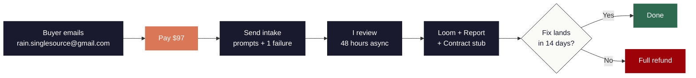
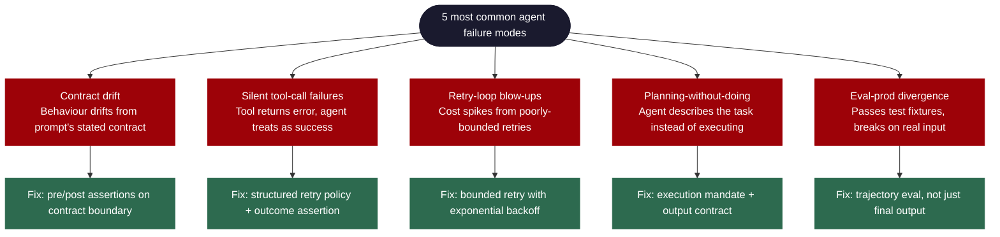

  
  
  

# Reasoning Audit

> Your AI agent fails silently. Find out why in **48 hours, $97**.

Send your agent prompts, code, and one example failure. You get back a 20 to 30 minute Loom walkthrough plus a 2-page Markdown report identifying your top three failure modes with concrete fixes.

**Refund if no fix lands inside 14 days.**

📩 [**Book the audit, $97**](mailto:rain.singlesource@gmail.com?subject=Reasoning%20Audit%20booking&body=Hi%20Rainier%2C%20I%27d%20like%20to%20book%20the%20audit.%20Please%20send%20payment%20instructions%20and%20the%20intake%20checklist.)

5 spots per week. Async, no calls.

---

## How it runs

---

## Built by

Rainier Potgieter, maintainer of [LOGIC.md](https://github.com/SingularityAI-Dev/logic-md): open-source declarative reasoning layer for AI agents (325 tests, 95.9% branch coverage on the compiler, MIT licensed, validated through Modular9 in production).

## Who this is for

- **You ship LLM agents.** They pass your evals and break in production.
- **You suspect contract drift** but nobody on the team has formalised the reasoning DAG.
- **You don't have a senior** who has shipped ten of these and seen the failure modes recur.

## What you get

### 1. Loom walkthrough (20 to 30 min)
I review your agent prompts, code, and example failures. I name the failure modes on camera so you can hand the recording to your team.

### 2. Markdown report (1 to 2 pages)
Top three failure modes ranked. Each comes with a fix recommendation and code or contract examples you can apply this week.

### 3. LOGIC.md contract stub (if applicable)
If your stack benefits, I write a reasoning contract that makes the top failure mode structurally impossible.

---

## Common failure modes I catch

---

## Market signal (May 2026)

| Signal | Source |
|---|---|
| 32% of teams cite quality as the top barrier for agents in production | Datadog, State of AI Engineering 2026 |
| Final-output evals miss 20-40% of agent failures vs. trajectory eval | LangChain, State of Agent Engineering 2026 |
| 8.4M rate-limit errors logged across LLM call spans, March 2026 alone | Datadog State of AI Engineering 2026 |
| Mastra (TS-first agents) hit 150k weekly npm downloads, $13M seed | Public reporting |

If your team is in those numbers, this audit is for you.

---

## How it runs (the details)

1. Email to book. Receive intake checklist within 5 minutes.
2. You send: agent prompts, one or two example failures, repo link or relevant code excerpt.
3. I deliver inside 48 hours of intake. Async, no calls. NDA on request.

## FAQ

**What if my framework is exotic?**
I cover vanilla OpenAI/Anthropic API, LangChain, LangGraph, LlamaIndex, CrewAI, AutoGen, Mastra, Vercel AI SDK, and custom orchestration. If your stack is genuinely too far outside that surface and I cannot help, full refund inside 24 hours of intake.

**Refund policy?**
Full refund if no fix recommendation lands inside 14 days of payment. Email and I refund.

**Will you sign an NDA?**
Yes. Send yours with the intake.

**Why $97? Why not more?**
Below the friction threshold for a senior engineer's approval ceiling. Launch price. Goes up once I have testimonials.

---

## Book

Email **rain.singlesource@gmail.com** with subject "Reasoning Audit booking" and I send payment instructions plus the intake checklist.

5 spots per week. When the week's spots fill, listing closes until next Monday.
